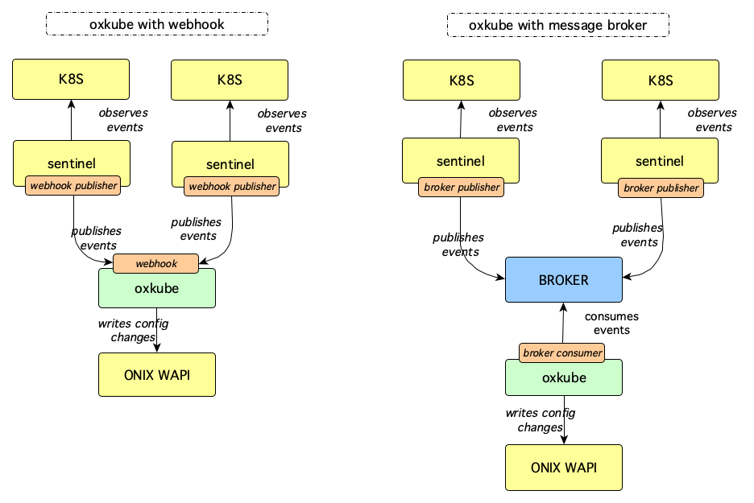

# OxKube

OxKube is an Onix feeder for Kubernetes events.

OxKube receives events from [KubeWatcher](../../sentinel/k8s/readme.md), either via a web hook or a message broker consumer, and updates the Onix CMDB.

