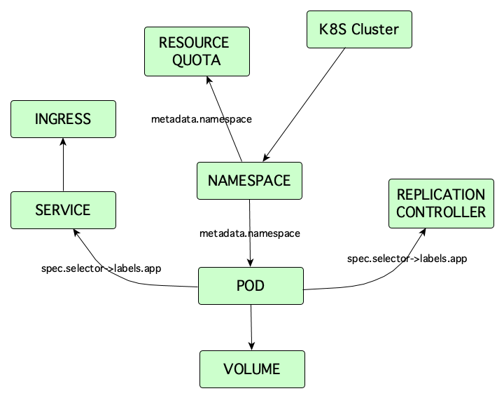

# Onix Agent for Kubernetes

Ox-Kube is an [Onix CMDB](http://onix.gatblau.org) agent for [Kubernetes](http://kubernetes.io).
 
 It consumes messages sent by [Sentinel](http://sentinel.gatblau.org), 
 either via a web hook or a message broker consumer, and updates the Onix CMDB when the status of Kubernetes resources change.
 
 

 ## Kubernetes Model

 The following diagram shows the model implemented in [Onix](http://onix.gatblau.org) to represent Kubernetes objects:

 

 