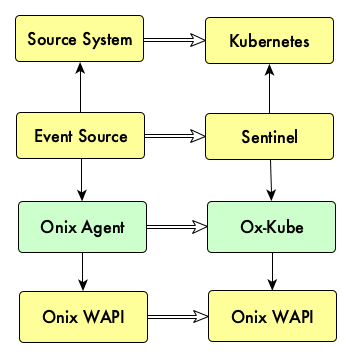

# Onix Agents

Onix agents are services that act on behalf of a piece of software 
and publish their events in a format that can be stored in the Onix CMDB.

For example, the Onix Kubernetes agent ox-kube, receives events produced in a 
standard format (from Sentinel) and saves them in a predefined format within the CMDB.

This can be seen in the model below:

A __source system__, for example [Kubernetes](https://kubernetes.io/) container orchestration, 
schedules the deployment of pods and their connectivity.
Other examples of source systems could be a cloud computing platform such as [Amazon EC2](https://aws.amazon.com/ec2/).

An __event source__ system, watches the source system for changes and publish the changes as events.
For example, [sentinel](http://sentinel.gatblau.org) watches the Kubernetes API for changes and 
publish them to either webhooks or a message queue.

An __Onix agent__, such as [ox-kube](./oxkube/readme.md), consumes events from the event source and 
records them in the Onix CMDB following the format of a specific meta-model, in this case,
the Kubernetes metamodel.  

The __Onix Web API__ provides a set of RESTful endpoints, that allow the agents to record configuration
data. 

_Agents become an extension_ of the Onix Web API to consume information for a particular platform for 
configuration management purposes.

Available agents are listed below:

| Agent | Description |
|---|---|
| [ox-kube](./oxkube/readme.md) | Onix agent for Kubernetes. |
 
