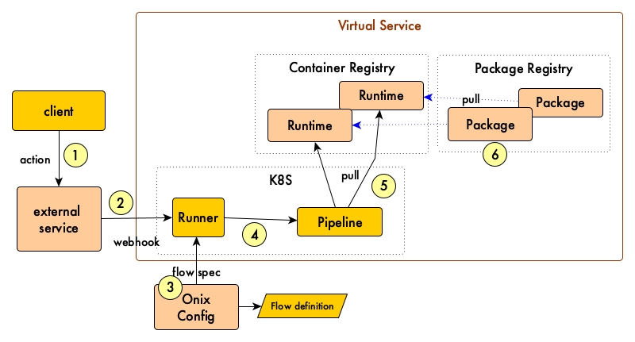

# Artisan Kubernetes Runner

Execute Artisan flows as Tekton pipelines.

The runner is a Kubernetes application that converts Artisan flows to Tekton pipelines and run the in Kubernetes.

## Invoking the Runner

The runner provides three distinct endpoints to create or start a flow:

| endpoint | method | description |
|---|---|---|
| `/flow` | `POST` | Creates and runs a flow from the flow definition in the http request body.   *This endpoint is typically used by the artisan CLI to fulfill the `art flow run` command*. |
| `flow/key/{key}/ns/{namespace}` | `POST` | Creates and runs a flow from the flow definition stored in the Onix configuration database.  The `key` in the URI is the unique identifier for the flow definition in the database. The `namespace` is the K8S namespace where the flow should run.  In addition, if a payload is passed as part of the http request, the runner converts it to a file with the name `payload` and stores it under the files section in the local artisan registry.   *This endpoint is* typically used to trigger flows from an event, such as the upload of a file to a repository, etc. |
| `flow/name/{name}/ns/{namespace}` | `POST` | Executes an existing flow by name in the specified namespace.  Any http payload is discarded.   *This endpoint is typically used to trigger flows in CI pipelines from git commits.*|

## Use Cases

### Triggering the Runner from the CLI

In this case you tell the artisan CLI to execute a flow and pass a runner name:

1. Invoke command `art flow run ...` passing flow definition and environment variables
2. Runner creates Tekton pipeline for the flow and runs it
3. Pipeline pull required runtimes
4. Runtimes pull required packages

### Triggering the runner from a Git commit

In this case, the runner starts an existing Tekton pipeline from a git commit:

1. Developer commits source to a git repository
2. The repository invokes the runner
3. Runner creates Tekton pipeline run for an existing pipeline
4. Pipeline run starts
5. Pipeline pulls required runtimes
6. Runtimes pulls required packages

### Triggering the Runner from a Generic Event (webhook)

The following figure shows the use case where an event in an external service trigger the Artisan runner:

1. Action happened to external service
2. Service invoke webhook in runner (and optionally pass a payload)
3. Runner pulls flow specification from Onix configuration
4. Runner creates Tekton pipeline for the flow and runs it
5. Pipeline pulls required runtimes
6. Runtimes pulls required packages

## Runner configuration

The runner can be configured with the following variables:

| var | description | default |
|---|---|---|
| `OX_METRICS_ENABLED` | enable prometheus /metrics endpoint | true |
| `OX_SWAGGER_ENABLED` | enable swagger user interface under /api/ | true |
| `OX_HTTP_PORT` | the port on which the server listen for connections | 8080 |
| `OX_HTTP_UNAME` | the basic authentication username | admin |
| `OX_HTTP_PWD` | the basic authentication password | adm1n |
| `OX_WAPI_URI` | the location of the Onix Web API | - |
| `OX_WAPI_UNAME` | the basic authentication username | admin |
| `OX_WAPI_PWD` | the basic authentication password | adm1n |

## Image location

quay.io/gatblau/artisan-runner