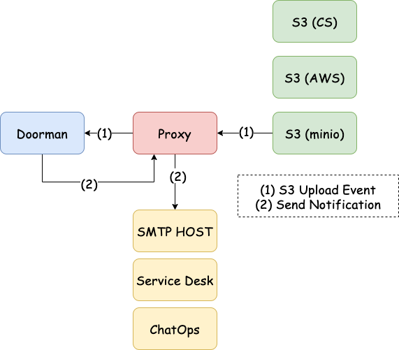

# Doorman's Proxy

Doorman's Proxy ensures that Doorman remains technology agnostic and allows 3rd parties to implement different event sources and notification types.

This project is offered as a guidance and the basis to create custom proxies.

## Events Source API

The event source API is designed to provide one or more endpoints to receive upload notification events from different storage technologies (e.g. MinIO, AWS S3, Google Cloud Storage, etc) translating the specific source formats into a technology agnostic format that is pass to Doorman.

**NOTE:** this API only implements an endpoint for MinIO format compatible senders.

Other implementations can be written by extending the proxy functionality.

### Events Source API Convention

The events source API naming conventions is:

**http(s)://{hostname}/events/{source-name}**

for example:

- <https://localhost:8080/events/minio>
- <https://localhost:8080/events/aws-s3>
- <https://localhost:8080/events/cloud-storage>

## Notifications API

The notifications API provides a technology agnostic Web API for Doorman to send notifications to different targets such as email,
service desks apps, ChatOps apps, etc.

**NOTE:** This API only implements email notifications.

Other implementations can be written by extending the proxy functionality.

### Notifications API Convention

The notifications API naming convention is:

**http(s)://{doorman-proxy-host}/notify**

## Swagger UI

A swagger UI for the proxy is available at:

**http(s)://proxy-host:proxy-port/api/**

## Security

The proxy acts an intermediary between doorman and any system raising events ensuring that only sanitised events are passed to doorman.

Additionally, doorman's API does not have to be publicly exposed, only the proxy endpoint.

Proxy endpoints are authenticated with a different bearer token per S3 source and can be IP whitelisted as an additional measure
tp block requests from untrusted sources.

