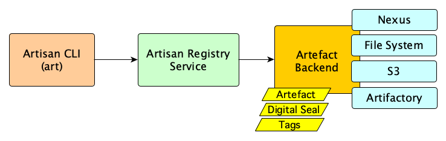

# Artisan Registry Service

Artisan can run as an HTTP based service providing a generic API that fronts one of many backends where artefacts can be stored.

The registry service provides an abstraction to manage the artefacts and their metadata in the same way regardless of the backend implementation used.

Currently, [Nexus Repository Manager 3](https://help.sonatype.com/repomanager3) is the only backend implementation. Other backends will be added in the future.

The service also provides a standard API that can be used by the Artisan Command Line Interface (CLI) or any other consumer to deal with artefacts packaged by Artisan.

The HTTP Api is documented using [OpenAPI](https://www.openapis.org/). A Swagger UI is available at the **/api/** endpoint.

The registry service interactions are shown in the following context diagram:

