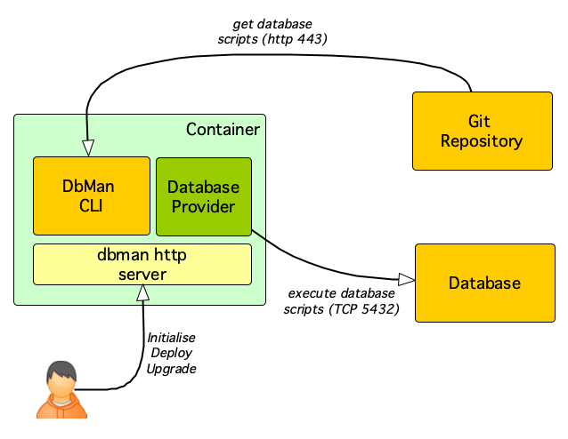

# DbMan - Onix Database Manager

DbMan is a command line interface application written in go, which aims at making it easy to track database versions, deploy schemas and functions and perform rolling upgrades.

DbMan enables development teams to keep their database scripts in a git repository and by the use of release manifests, automate the orchestration repetitive database release logic.

DbMan can be run in a docker container so that it can enable modern application deployment scenarios from a container platform such as Kubernetes.

Other functions such as backup/restore are currently being considered.

It currently supports PostgreSQL database but other database types are planned in the future using a plugin architecture.

## Architecture

The following image shows how DbMan works as an HTTP service:



Once DbMan is deployed, a user can call restful endpoints to trigger database management operations.

## Git repository structure

The database scripts are stored in a [Git](https://git-scm.com/) repository following a pre-defined directory structure that contains the history of all releases.

An example of the directory structure can be seen [here](https://github.com/gatblau/ox-db).

The following artefacts are part of the repository:

| item | description |
|---|---|
| [release plan](https://github.com/gatblau/ox-db/blob/master/plan.json) | Contains a list of all available releases, including the mapping between application release and corresponding database release |
| [init folder](https://github.com/gatblau/ox-db/tree/master/init) | Holds the database initialisation scripts, such as for creating the database, creating a database user, deploying certain schema extensions, etc. |
| [release folder](https://github.com/gatblau/ox-db/tree/master/v4) | Contains the scripts to perform a specific database release. |

Either the init and release folders contain manifest files used by DbMan to orchestrate the execution of the database scripts.

Examples of these files are:

- [initialisation manifest](https://github.com/gatblau/ox-db/blob/master/init/init.json)
- [release manifest](https://github.com/gatblau/ox-db/blob/master/v4/release.json)

## Command hierarchy

When DbMan is used as a CLI application, the following commands are available:

| level 1 | level 2 | description | example |
|---|---|---|---|
| config | - | manages configuration sets | `dbman config [command]`|
| config | *show* | shows the content of the current configuration set | `dbman config show` |
| config | *use* | use a named configuration set. thsi command creates a new set if it does not exists and switches to it. | `dbman config use -n dev` |
| config | *list* | list all the available configuration sets indicating which is the selected one | `dbman config list` |
| config | *set* | sets a configuration value in the current set | `dbman config set schema.uri https://github.com/myrepo`|
| release | - | shows release information | `dbman release [command]` |
| release | *plan* | shows the release plan in the scripts repository | `dbman release plan` |
| release | *info* | show a specific release information | `dbman release info 0.0.4` |
| db | - | database maintenance tasks | `dbman db [command]` |
| db | *init* | initialises the database using the init manifest in the /init folder in the scripts repo | `dbman db init` |
| db | *deploy* | deploys the schema and objects for a particular release from the scripts repo | `dbman db deploy 0.0.4` |
| db | *upgrade* | upgrades the schema and objects to a particular release | `dbman db upgrade 0.0.4` |
| db | *version* | shows the version history in the tracking table | `dbman db version` |
| db | *backup* | takes a database backup | `onix` |
| db | *restore* | restores a database backup | `0ni1x659w!` |
| serve | - | starts dbman as an http service | `dbman serve` |

## Container Image Configuration

The container image can be configured by passing the following environment variables:

| var | description | default |
|---|---|---|
| `OX_DBM_APPVERSION` | The database schema version to use | N/A |
| `OX_DBM_THEME` | The Web UI theme (skin) to use when calling reporting functions on a web browser. | empty |
| `OX_DBM_HTTP_METRICS` | Whether prometheus `/metrics` endpoint is enabled. Only available if running dbman as an http service. | `true` |
| `OX_DBM_HTTP_AUTHMODE` | The authentication mode used by dbman http service. Acceptable values are `none` or `basic` for basic user authentication tokens. <br>Only available if running dbman as an http service. | `basic` |
| `OX_DBM_HTTP_PORT` | The port the http server is listening on.<br>Only available if running dbman as an http service. | `8085` |
| `OX_DBM_HTTP_USERNAME` | The username for the http service basic user authentication. <br>Only available if running dbman as an http service. | `admin` |
| `OX_DBM_HTTP_PASSWORD` | The password for the http service basic user authentication. <br>Only available if running dbman as an http service. | `0n1x` |
| `OX_DBM_DB_PROVIDER` | The database provider to use. Currently the only supported provider is PostgreSQL. | `pgsql` |
| `OX_DBM_DB_NAME` | The name of the database to manage. | `onix` |
| `OX_DBM_DB_HOST` | The database host | `localhost` |
| `OX_DBM_DB_PORT` | The database port | `5432` |
| `OX_DBM_DB_USERNAME` | The database user name | `onix` |
| `OX_DBM_DB_PASSWORD` | The database user password | `onix` |
| `OX_DBM_DB_ADMINUSERNAME` | The database admin user | `postgres` |
| `OX_DBM_DB_ADMINPASSWORD` | The database admin password | `onix` |
| `OX_DBM_REPO_URI` | The root path of the database scripts. | `https://raw.githubusercontent.com/gatblau/ox-db/master` |
| `OX_DBM_REPO_USERNAME` | The username for the scripts repository. | `git-username-here` |
| `OX_DBM_REPO_PASSWORD` | The token/password for the scripts repository. | `git-password-here` |

## Swagger Web API

When DBMan is launched as an HTTP service (see dbman serve command), then a Swagger user interface is available at the [/api](http://localhost:8085/api) endpoint.

It is worth noting that when running as HTTP service, only  the [default configuration set](./.dbman_default.toml) is available. It is not possible to switch configuration sets as the service is intended to run in a container. Therefore, the only way to change the configuration values is through environment variables as described in the previous section.

## Sample database scripts repository

For an example of the structure of the scripts repository required by dbman, [see here](https://github.com/gatblau/ox-db/).

## Container Registry

DbMan images can be found below:

| type | repo | image | tag |
|---|---|---|---|
| snapshot | docker.io | [gatblau/dbman-snapshot](https://hub.docker.com/repository/docker/gatblau/dbman-snapshot/general) |  latest |

## Building DbMan

```bash
# clone the project
$ git clone https://github.com/gatblau/onix

# navigate to the dbman folder
$ cd dbman

# build it - needs golang (see https://golang.org/doc/install)
$ go build

# call dbman
$ ./dbman --help
```

## Running DbMan from a container

For an example of how to run a DbMan container to deploy a PostgreSQL database [see here](https://github.com/gatblau/onix/blob/develop/docs/install/container/refresh_db.sh).

The following example shows how to launch dbman in a container connecting to a postgres database and deploying the Onix database:

```bash
# set DB password
DBPWD="mypass"
# set app release version
APPVER="0.0.4"

# launch a postgres database container pgdb
docker run --name pgdb -it -d -p 5432:5432 \
     -e POSTGRESQL_ADMIN_PASSWORD=${DBPWD} \
     "centos/postgresql-12-centos7"

# launch dbman and link it to pgdb
docker run --name dbman -itd -p 8085:8085 \
  --link pgdb \
  -e OX_DBM_DB_HOST=pgdb \ # the host name of the database server
  -e OX_DBM_DB_PORT=5432 \ # the database server port
  -e OX_DBM_DB_USERNAME=onix \ # the database user
  -e OX_DBM_DB_PASSWORD=onix \ # the database user password
  -e OX_DBM_DB_ADMINPWD=postgres \ # the database admin user
  -e OX_DBM_DB_ADMINPWD=${DBPWD} \ # the database admin password
  -e OX_DBM_HTTP_AUTHMODE=none \ # no authentication of dbman http service
  -e OX_DBM_SCHEMA_URI=https://raw.githubusercontent.com/gatblau/ox-db/master \ # the onix schema git repo 
  "gatblau/dbman-snapshot"

# create the database by calling dbman init
curl -X POST http://localhost:8085/db/init 2>&1 

# create schemas and functions by calling dbman deploy
curl -X POST http://localhost:8085/db/deploy/$APPVER 2>&1
```
---

**Note** DbMan is work in progress, it will eventually replace and augment the logic for deploying and upgrading the database currenlty in the Onix Web API
and allow a Kubernetes operator to orchestrate the required database admin tasks.
