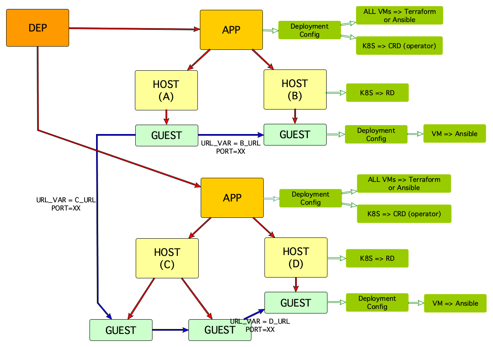

# The DEP model

DEP uses an Onix model to capture application landscape dependencies as shown in the following figure:

## Item Types

| Item Type | Description |
|---|---|
| **DEP** | Represents the configuration of an application landscape. |
| **APP** | Represents an application that is comprised of one or more hosts (Operating Systems) or pods (in Kubernetes).   An application can define a deployment configuration, for example, if there is a Kubernetes Custom Resource Definition for an operator that deploys the whole application.   In case of an application on traditional infrastructure, the deployment configuration can be a Terraform file or an Ansible playbook that deploy all the hosts required by the application services to run on. |
| **HOST** | Hosts can be of two types, Operating System (in the case of traditional infrastructure) or POD (in the case of Kubernetes).   If the host is a Kubernetes Pod, a deployment configuration can be defined as a set of Kubernetes Resource Descriptions to deploy one or more containers (guests) in the pod. |
| **GUEST** | Guests are deployed in a host.   If a host is an Operating System, it can have a deployment configuration as an Ansible playbook to deploy the guest on it. |

## Link Types

| Link Type | Description |
|---|---|
| COMPOSITION | Red links are **composition** links. They define what hosts are included in an app and what guests belong in a host.|
| DEPENDENCY | Blue links are **dependency** links. They define how a guest depends on another guest by indicating the communication between them. |

