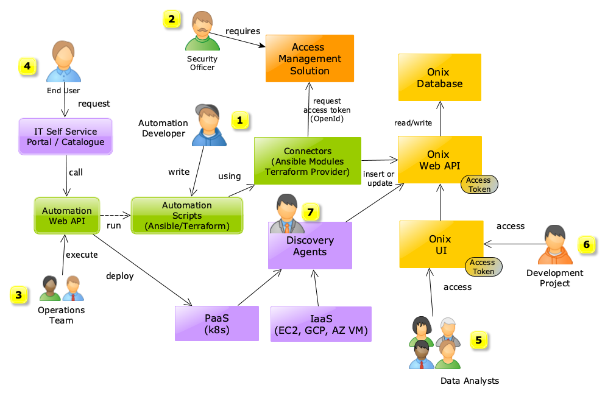
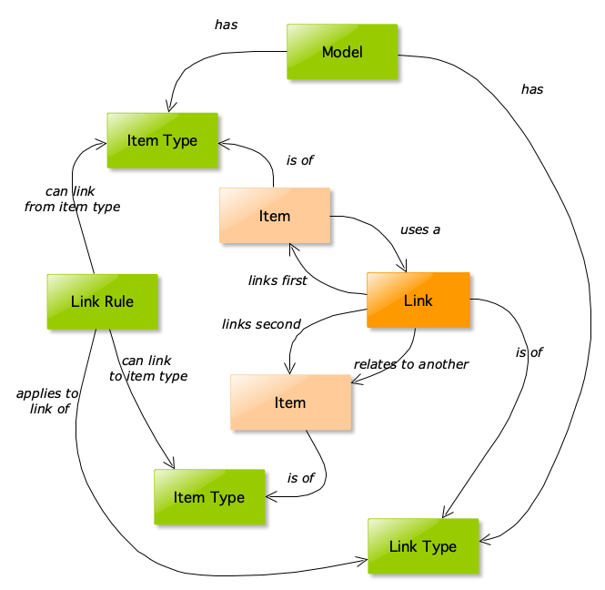
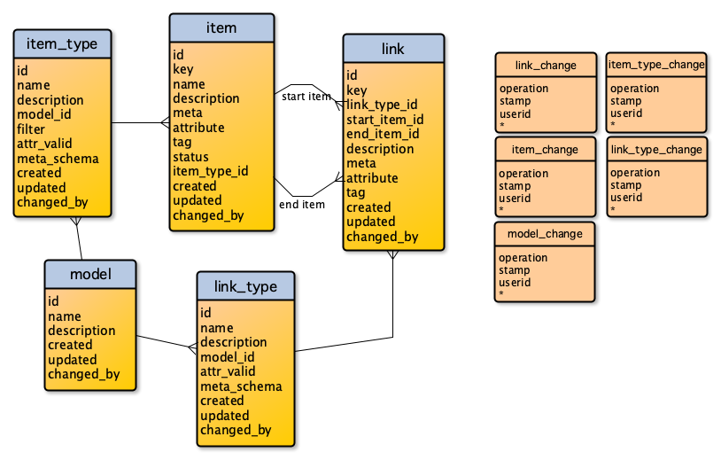
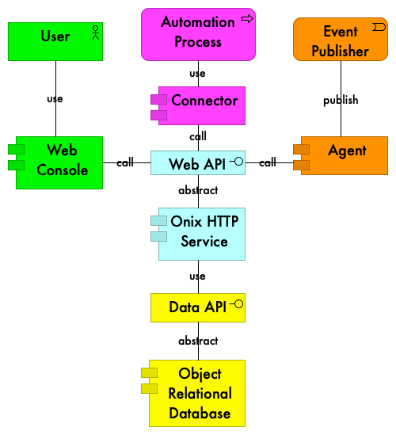
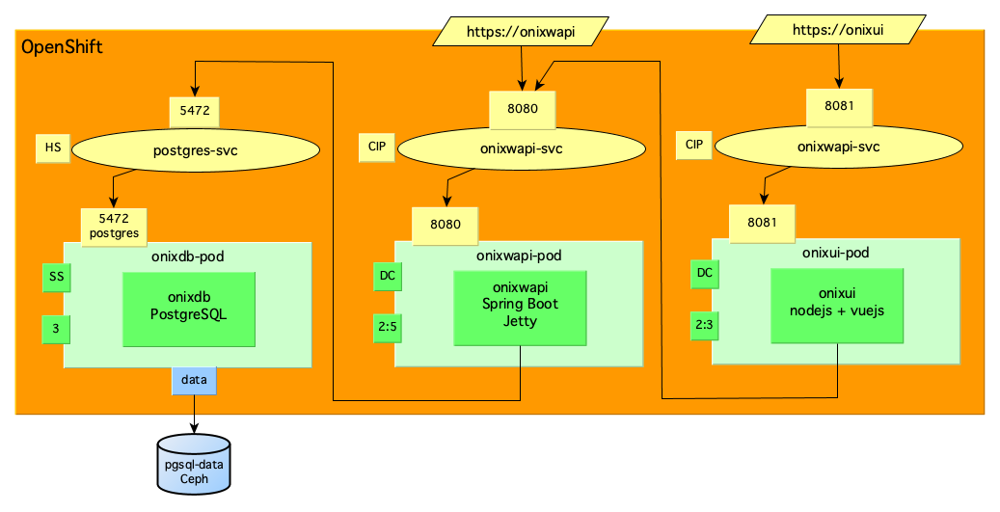
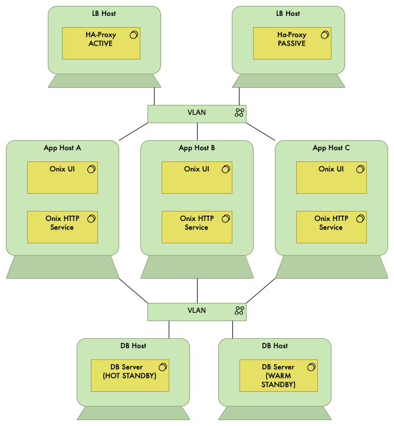

# Architecture 

This section provides an architectural overview.

### Table of Contents [(index)](./../readme.md)

- [Business View](#business-view)
- [Data View](#data_view)
- [Application View](#application-view)
- [Technology View](#technology-view)

## Use Cases

The diagram below shows high level use cases for Onix based on different personas: 

 

### Automation developer [1] [(up)](#toc)
 
Is concerned with **recording and testing configuration data changes** in a seamless way.

Developers write automation scripts and use connectors to record configuration data changes in the Onix CMDB via its Web API.
CMDB change records are tested as part of the automation development life cycle.

### Security officer [2] [(up)](#toc)
 
Is concerned with **securing access to configuration data** whilst leveraging organisation wide Identity and Access Management (IDAM) solutions.

To achieve this Onix provides [OIDC](https://openid.net/connect/) support.

### Operations team [3] [(up)](#toc)

Is concerned with **recording configuration data changes seamlessly** whilst executing automation scripts. 

As the development phase embedded and tested configuration data recording in the automation scripts, there is nothing for the Operations team to do other than execute the automation and observe changes made to the CMDB.

### End user [4] [(up)](#toc)

Is concerned with **requesting catalogue items** to be promptly deployed.

Any IT Self Service portal can provide the means to issue configuration change requests to an Automation Web API.
Configuration data changes are automatically recorded by the automation scripts.

### Data Analyst [5] [(up)](#toc)

Is concerned with **querying accurate configuration information at all times** for a variety of purposes.

As configuration data is updated when the automation scripts are executed, and has been tested as part of the development lifecycle, the information should be accurate and ready for reporting at all times.

### Development Project Members [6] [(up)](#toc)

Are concerned with **having visibility of applications and services** deployed on the infrastructure.

## Data View

## Semantic Model [(up)](#toc)

The following figure shows the [semantic model](https://en.wikipedia.org/wiki/Semantic_data_model) for the CMDB:
 

- **Items** store configuration information and can be associated to other items using **Links**.
- **Items** are of a specified **Item Type**.
- **Links** connect **Items** creating associations.
- **Links** are of a specified **Link Type**.
- **Link Rules** apply to particular **Links** and restrict what **Item Types** the **Link** can connect.
- **Models** are collections of **Item Types** and **Link Types**.

## Logical Model [(up)](#toc)

The following picture shows the Onix logical data model:

## Application View

The following picture shows the application components and their interactions:

 

## Technology View

#### Containerised deployment

The following picture shows the deployment for OpenShift or Kubernetes:

 

#### Traditional deployment

The following picture shows the deployment on traditional infrastructure:

 

