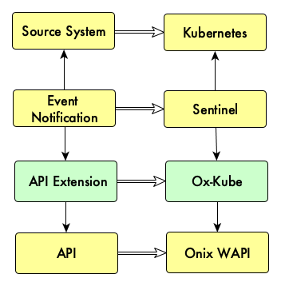

# Onix API extensions

Onix API extensions are micro services that extend the use of the Web API for a specific use case or integration.

The Onix Web API is completely generic and therefore, it does not have any knowledge of use for a particular purpose; for example, Kubernetes applications configuration, Terraform state, Ansible Inventories, etc.

Thus, there is a need to create an extensible system that allows for encapsulation of knwoledge required to fullfil a concrete use case. This is where extensions and micro-service architecture come in place.

Take for example the case of automatically recording Kubernetes application configuration changes in real time in Onix. The Onix Kubernetes Extension service (OxKube), extends the Web API with knowledge of the Kubernetes meta model, i.e. namespaces, services, pods, etc. and the logic to record their changes in Onix.

This can be seen in the model below:

A __source system__, for example [Kubernetes](https://kubernetes.io/) container orchestration, 
schedules the deployment of pods and their connectivity.
Other examples of source systems could be a cloud computing platform such as [Amazon EC2](https://aws.amazon.com/ec2/).

An __event source__ system, watches the source system for changes and publishes the changes as events.
For example, [sentinel](http://sentinel.gatblau.org) watches the Kubernetes API for changes and
publish them to either webhooks or a message queue.

An __Onix Extension__, such as [ox-kube](../k8s/oxkube/readme.md), consumes events from the event source and
records them in the Onix database following the format of a specific meta-model, in this case,
the Kubernetes meta model.  

The __Onix Web API__ provides a set of RESTful endpoints, that allow the agents to record configuration
data.
