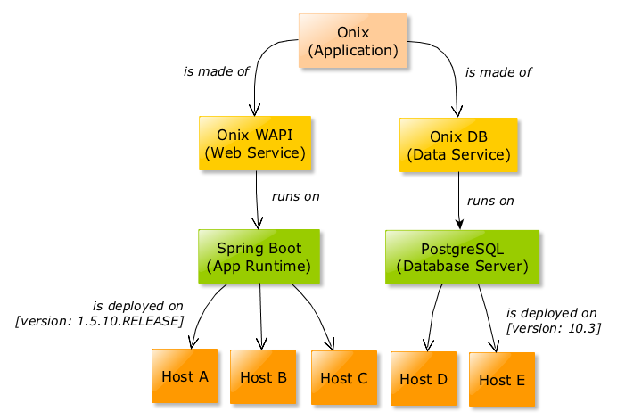

# CMDB Model

## Table of Contents [(index)](./../readme.md)

- [Semantic Model](#semantic-model)
- [Relational Model](#relational-model)
    - [Item Entity](#item)
    - [Item Type Entity](#item-type)
    - [Link Entity](#link)
    - [Dimension Entity](#dimension)
    - [Auditing changes](auditing-changes)
- [Modelling a specific configuration](#modelling)

## Semantic Model [(up)](#toc)

The following figure shows the [semantic model](https://en.wikipedia.org/wiki/Semantic_data_model) for the CMDB:
 

**Items** store configuration information and can be associated to other items using **Links**.

**Items** ar of a specified **Item Type**.

## Relational Model [(up)](#toc)

In order to store configuration data Onix uses a simple relational model as shown below:

Curretly, the database schema is implemented in PostgresSQL.

## Item Entity [(up)](#toc)

The Item entity stores information for configuration items. 

Items can be anything that needs to be recorded for example, Virtual and Physical Servers, Middleware, People, etc.

For user purposes, an Item is uniquely identified using a natural key, that is, a unique key formed of attributes which already exist in the configuration domain.
For instance, a Virtual Machine could be identified with a code like "VM-EUR-DC01-ABC". The natural key should never change for that item as it is used to identify the item and execute subsequent updates once the item has been created.

For database relational purposes, an item has a surrogate key used by [Hibernate](https://github.com/hibernate/hibernate-orm) to manage the entities.

### Attributes

|Name | Description | Data Type|
|---|---|---|
|id | Surrogate key. | bigint |
|key| Natural key. | character varying(100)|
|name| A user friendly name assigned to the item for displaying purposes. | character varying(200) |
|description| The description of the item | text |
|meta| A JSON object of any structure, containing all the specific information for a given configuration item. | json |
|status| A number indicating the deployment status of the item. The regex to use is up to the client system. For example, 1 / 2 / 3 could mean waiting to be deployed / deployed / fail to deploy respectively. Its default regex is 0.| smallint |
|tag| A text field to support semantic tagging. |character varying(300) |
|created| The date and time the item was created. | timestamp(6) with time zone|
|updated| The date and time the item was last updated. | timestamp(6) with time zone |
|item_type_id| The type of configuration item. | integer |

## Item Type Entity [(up)](#toc)

The Item Type entity contains the definition of the various types of configuration items.

In order to use the CMDB, item types should be created according to the needs of the particular configuration domain.
Some types are reserved for application use and therefore they should not be deleted (they are marked is a custom=false attribute).

### Attributes

|Name | Description | Data Type|
|---|---|---|
|id | Surrogate key. | bigint |
|name| A user friendly name for the type. | character varying(200)|
|description| The description of the item type. | character varying(500) |
|custom| A flag used by the WAPI to discern between system and custom types. | boolean |

## Link Entity [(up)](#toc)

The Link entity is an association between two items. 

Links allow to create relationships between items for reporting purposes and can optionally store link specific metadata in the association.

Like Items, Links have to be uniquely identified using natural keys. 
 
### Attributes

|Name | Description | Data Type|
|---|---|---|
|id | Surrogate key. | bigint |
|key| Natural key. | character varying(100)|
|role| A friendly description of the message performed by the link, for example "connects", "hosts", etc. | character varying(200) |
|description| The description of the link. | text |
|meta| A JSON object of any structure, containing all the specific information for a given link. | json |
|created| The date and time the link was created. | timestamp(6) with time zone |
|updated| The date and time the link was last updated. | timestamp(6) with time zone |
|start_item_id| The surrogate key of one of the items associated by the link. | bigint |
|end_item_id| The surrogate key of the other item associated by the link. | bigint |

## Dimension Entity [(up)](#toc)

The dimension is a mechanism to attach an indefinite number of key/regex pairs for reporting purposes.

For example, Items might be associated with projects so it would be beneficial to know the project work break down structure (WBS) code for the item.

Then, a reporting dimension could be added to the item as follows: key="WBS" and regex="OP011.896WIE".

### Attributes

|Name | Description | Data Type|
|---|---|---|
|id | Surrogate key. | bigint |
|item_id| The unique identifier for the item the reporting dimension is for. | bigint |
|key| A reporting dimension key (e.g. "WBS") | character varying(50) |
|regex| A reporting dimension regex (e.g. OP011.896WIE) | character varying(100) |

## Auditing Changes [(up)](#toc)

All changes to Items, Links and Item Types are recorded (via database triggers) on dedicated audit tables.

Audit tables contain the same attributes than the table they are auditing but add the following attributes:

|Name | Description | Data Type|
|---|---|---|
|operation | "I" for insert, "U" for update and "D" for delete. | character(1) |
|change_date| The time of the change. | timestamp |
|change_user| The user who performed the change. | text |

## Modelling a specific configuration [(up)](#toc)

Let's consider for example, the case of an application such as Onix and how it can be deployed on Virtual Machine infrastructure.

A semantic configuration model could tipically define the following configuration information:

- The Onix Application is made of one Web Service and one Data Service.
- The Web Service is deployed on Hosts A, B and C; whilst the Data Service is deployed on Hosts D and E.
- The Web Service runs on Spring Boot application runtime.

A graphical representation of the above is:

``
 
For an example of a playbook to produce the above configuration see [here](../ansible/site.yml).