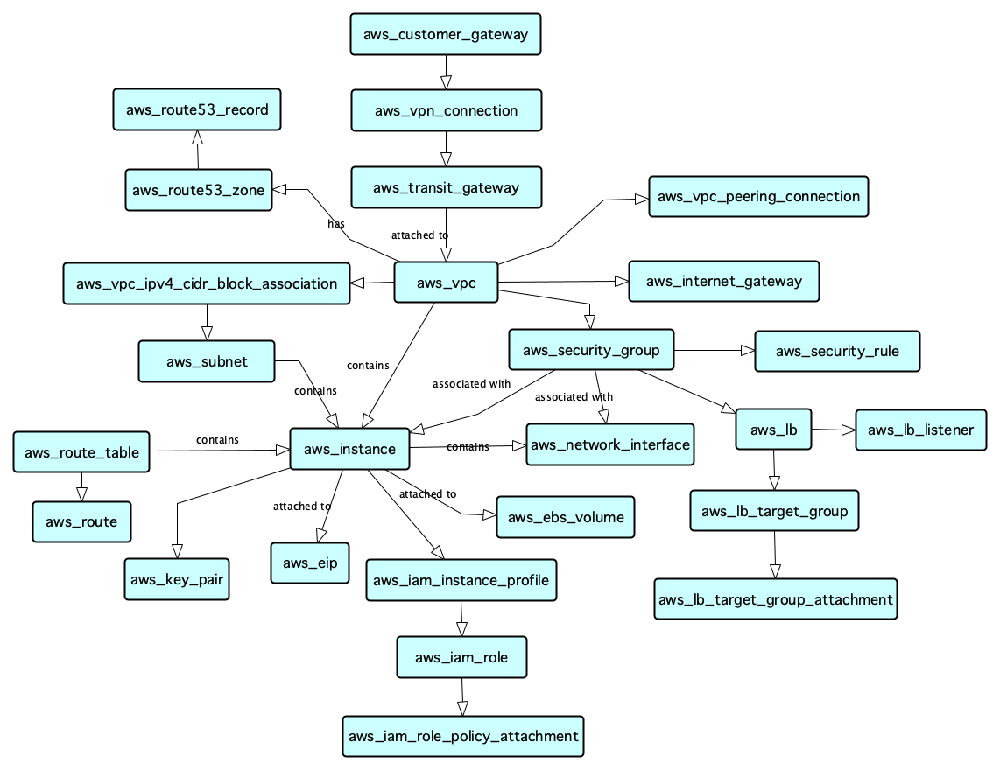

# AWS Elastic Compute Cloud Model



To import the model apply this [Terraform file](main.tf).

N.B. You will first need to build the Onix Terraform provider and copy it to this directory:

```
cd connectors/terraform/provider
make build
cp terraform-provider-ox ../../../docs/models/aws_ec2/
