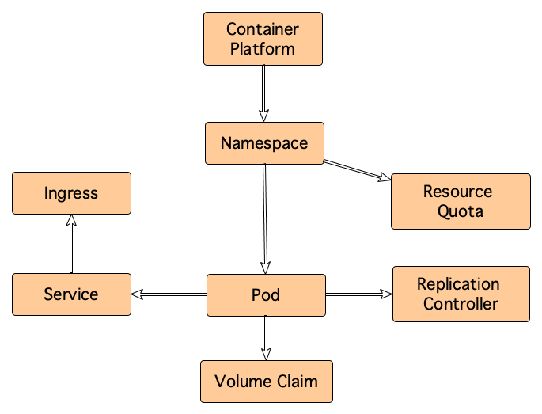

# Kubernetes Model

The model below is used to capture application deployment information in [Kubernetes](https://kubernetes.io/) / [OpenShift](https://www.openshift.com/).

The model aggregates information across Kubernetes clusters using the **K8S Cluster** Configuration Item (CI).

The model describe the following relationships between Kubernetes objects:

- A **Container Platform** has **Namespace**s
- A **Namespace** contains **Pod**s
- **Namespace**'s resources are limited by a **Resource Quota**
- The **Pod**'s network is exposed by a **Service**
- A **Service**'s external access is managed by an **Ingress**
- A **Pod**'s life cycle is managed by a **Replication Controller**
- A **Pod** requests persistent storage using a **Volume Claim**

The metamodel above is used by [OxKube](../../../agents/oxkube/readme.md).

Upon start, OxKube looks for the model definition in Onix and automatically creates one if it is not found.
