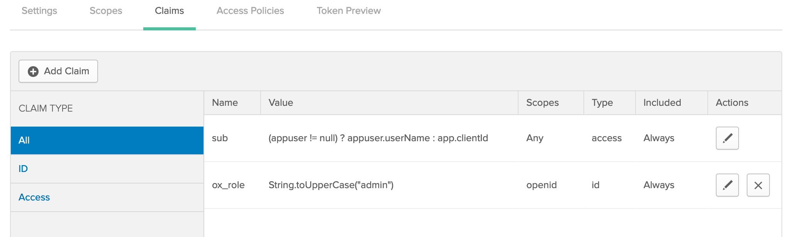

# Using OpenId Connect 

In the beginning, there were proprietary approaches to working with external identity providers for authentication and authorisation. 

Then came SAML (Security Assertion Markup Language) – an open standard using XML as its message exchange type. Then, there was OAuth and OAuth 2.0 using a RESTful approach to authorisation using JSON as its data format. 

Today, the preferred way of dealing with “secure delegated access” is OpenID Connect (a.k.a OIDC).

[OpenID Connect](https://openid.net/connect/) is a simple identity layer on top of the OAuth 2.0 protocol, that specifies a RESTful HTTP API, using JSON as a data format.

 It allows computing clients to verify the identity of an end-user based on the authentication performed by an authorisation server, as well as to obtain end-user profile information.

 Onix clients can choose to authenticate using the OpenId Connect API by specifying the information required to connect to an authentication server.

 In order to authenticate using an OpenId Connect provider, a client application must be created in the provider first. For examples of how to create a client application see:
 - [Creating a Client App with Google](https://developers.google.com/identity/protocols/OpenIDConnect)
 - [Creating a Client App with Okta](https://developer.okta.com/blog/2017/03/21/spring-boot-oauth#create-an-openid-connect-app-in-okta)
 
 In addition, the following environment variables should be specified when launching the Onix WAPI application:

 | Variable | Description | 
 |---|---|
 | __AUTH_MODE__ | The authentication mode used by the Onix Web API, must be set it to "__oidc__". |
 | __OIDC_ISSUER__ | The name of the token issuer. |
 | __OIDC_JWKURL__ | The URI whwre the issuer has published the JavaScript Web Key certificates used to validate Java Web Tokens. |
 | __OIDC_REDIRECT_URI__ | The resource server endpoint prfroming the login. __Note:__ in the Onix Web API the endpoint is "_/oidc-login_". |
| __OIDC_USER_AUTH_URI__ | The URI of the authorisation server. |
| __OIDC_ACCESS_TOKEN_URI__ | The URI of the token resource. |
| __OIDC_CLIENT_SECRET__ | The client secret used to authenticate with the authorisation server. |
| __OIDC_CLIENT_ID__ | The unique identifier for the client application to be protected. |

__Note:__ client id and secret values are created when setting up a new client application in the OpenId provider.

## Google OpenId API example

The following values apply to a google provider:

| Variable | Value |
|---|---|
| __AUTH_MODE__ | oidc |
| __OIDC_ISSUER__ | accounts.google.com |
| __OIDC_JWKURL__ | https://www.googleapis.com/oauth2/v2/certs |
| __OIDC_REDIRECT_URI__ | http://localhost:8080/oidc-login |
| __OIDC_USER_AUTH_URI__ | https://accounts.google.com/o/oauth2/auth |
| __OIDC_ACCESS_TOKEN_URI__ | https://www.googleapis.com/oauth2/v3/token |
| __OIDC_CLIENT_SECRET__ | 24 character string |
| __OIDC_CLIENT_ID__ | id_string + .apps.googleusercontent.com |

Information on how to create an OpenId Connect application using Google OAuth 2.0 APIs can be found [here](https://developers.google.com/identity/protocols/OpenIDConnect).

## OKTA OpenID API example

The following values apply to an Okta provider:

| Variable | Value |
|---|---|
| __AUTH_MODE__ | oidc |
| __OIDC_ISSUER__ | https://dev-447786.okta.com/oauth2/default |
| __OIDC_JWKURL__ | https://dev-447786.okta.com/oauth2/default/v1/keys |
| __OIDC_REDIRECT_URI__ | http://localhost:8080/oidc-login |
| __OIDC_USER_AUTH_URI__ | https://dev-447786.okta.com/oauth2/default/v1/authorize |
| __OIDC_ACCESS_TOKEN_URI__ | https://dev-447786.okta.com/oauth2/default/v1/token |
| __OIDC_CLIENT_SECRET__ | 40 character string|
| __OIDC_CLIENT_ID__ | 20 character string |

Information on how to create an OpenId Connect application in Okta can be found [here](https://developer.okta.com/blog/2017/03/21/spring-boot-oauth#create-an-openid-connect-app-in-okta).

## Authorising users

In order to authorise logged on users, the OpenId token must contain a claim called __ox_role__ with the name of the role granted to the user.

The following picture shows how to add a static claim in an Okta token:

Typically, this claim should be added based on the user group membership in the backing user directory.

This role is then mapped within Onix to partitions via Read, Write and/or Delete privileges.

For more information about Role Based Access Control see [here](./rbac.md).
