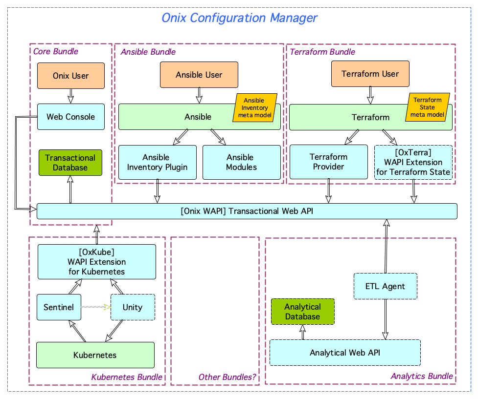

# Onix Configuration Manager

## From CMDB to Configuration Manager

Onix started its first release as a configuration management database (CMDB) recording application / infrastructure configuration changes for compliance and management purposes using Ansible&copy;.

Shortly after that, it became apparent that integrating the database with Terraform&copy; was also useful if deployment of infrastructure was driven from Terraform&copy;.

With the emergence of container platforms, and in particular Kubernetes&copy;, there was an increasing interest in recording application configuration changes automatically, by reactively listening for changes in the platform and recording them in the database. This approach meant that no automation client would be needed to record changes of workloads configuration operating in the container platform.

Furthermore, it should also be possible to drive changes in system configuration from changes in the configuration database (the reverse flow as compared to the previous case).

At this point, Onix becomes more than a database (CMDB), but at _reactive configuration manager_.

## Overview

The Configuration Manager follows a microservices architecture, allowing for suites of independently deployable services and components to be, incrementally or selectively, added to the solution to fulfill particular use case scenarios.

This modular design is comprised of bundles, which address the requirements of different users.

A core bundle is supplemented by additional bundles as shown in the diagram of the current solution below:

An explanation of each bundle's components follows.

---

## Core Bundle

The core bundle is the smallest possible configuration of the solution. It is comprised of a Web Console, the transactional Web API and database.

| Service | Description |
|---|---|
| __Onix Web Console__ | Users can log in the web console to see and modify configuration information stored in the database.
| __Onix WAPI__ | The Web API provides RESTful endpoints for performing operations in the Onix Database. |
| __Onix Database__ | The PostgreSQL database containing the Onix information schemas. |
---

## Ansible&copy; Bundle

The Ansible&copy; bundle is comprised of a set of Python web client scripts that facilitate the integration between Onix and Ansible&copy;.

| Service | Description |
|---|---|
| Inventory Plugin | Allows Ansible to read inventory information stored in Onix. |
| Modules | Allows to create, update and delete configuration information in Onix via its WAPI. |
---

## Terraform&copy; Bundle

The Terraform&copy; bundle is comprised of a provider and a WAPI extension to allow Onix to be used as a Terraform&copy; HTTP backend.

| Service | Description |
|---|---|
| __Onix Provider__ | A Terraform&copy; provider for Onix exposing Onix objects as Terraform&copy; resources. |
| __OxTerra__ | An extension to the Onix WAPI to support storing Terraform&copy; state in Onix implementing the Terraform&copy; HTTP backend API. |
---

## Kubernetes&copy; Bundle

The Kubernetes&copy; bundle is comprised of a set of microservices which support automated recording of application configuration information for compliance and management across Kubernetes clusters.

Additionally, an application federation function is planned to replicate applications across clusters following federation policies stored in Onix.

| Service | Description |
|---|---|
| __OxKube__ | An extension of the Onix WAPI for Kubernetes, responsible for consuming application configuration changes and updating Onix. |
| __Sentinel__ | A microservice which publishes configuration changes in a Kubernetes cluster. |
| __Unity__ | A planned microservice which replicate application deployments across Kubernetes clusters for federation purposes. |

__NOTE:__ _Unity is currently not available but planned for future releases_.

---

## Analytics Bundle

The Analytics bundle is a future set of components that will aggregate configuration information in a centralised data warehouse for reporting and analytics.

## Other Bundles

Other bundles could be implemented to extend the automatic recording and federation capabilities to other platform and or cloud providers.

## Feedback

If you would like to send feedback about the software, its components or any suggestions for new features or updates to existing features, please email me at onix@gatblau.org

