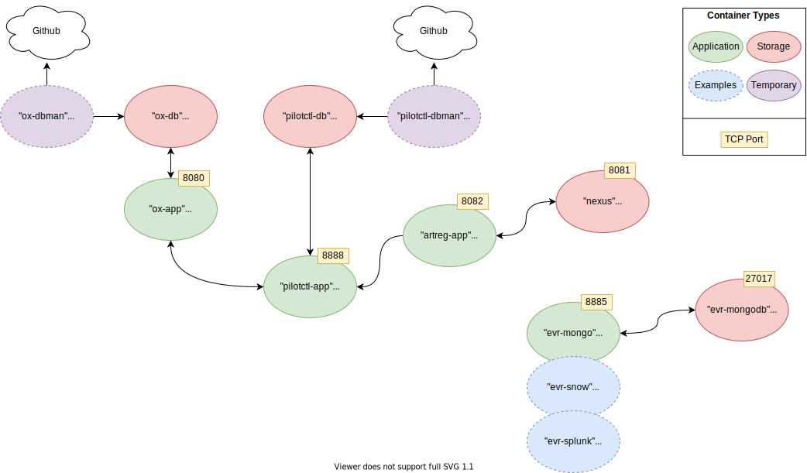

# Onix

Onix has a number of services that go to make up the whole project:

- PostgreSQL and Mongo database servers
- Onix database
- PilotCtl database
- Onix Web API Service
- PilotCtl HTTP Service
- DbMan instances for database provisioning
- Event receiver service(s)



This folder contains everything you need to build your own Onix package (in Artisan format) and deploy it out to your local or remote test/development VM.

### Pre-requisites
- [Docker](https://get.docker.com)
The latest version is automatically pulled by the script at this URL. For security, it is recommended to review the script prior to running as `sudo`
- [Docker Compose](https://github.com/docker/compose/releases)
Suggested version is `1.29.2` (I.E. the latest v1 Docker Compose.)
- [Artisan CLI tool](https://github.com/gatblau/artisan/releases/tag/v1.0)
`art -v` should be a version equal or later than `0.0.4-201021` (I.E. 20th october 2021)


### Package functions

The functions available in the package are:

function | description
--- | ---
deploy | deploys a completely new Onix from scratch
stop | stops the stack but keeps the containers and persistent data
start | re-starts an existing stack
destroy | destroys the stack completely, including any persistent data
info | displays helpful information and credentials

### Configuration Data

As the various functions of the Artisan package need persistent data, the configuration data is held in a fixed directory on the host (if you need to change this please review the helper scripts accordingly).

Because of this, the default way that Artisan works needs to be over-ridden - please use the examples below as a starting point for deploying out Onix (the environment variables `REG`, `REG_USER` and `REG_PASS` are presumed to be set correctly for your registry.)

### Build example
An example of how to build and push your package (*nb. make sure you are in the `install` directory not the `content` directory*)
`art build -t $REG/mygroup/deploy-onix`
`art push $REG/mygroup/deploy-onix -u $REG_USER:$REG_PASS`

### Install example
Pull the latest version of your package (*optional*)
`art pull $REG/mygroup/deploy-onix -u $REG_USER:$REG_PASS`

Execute the deployment function of your package
`art exe --path string --preserve-files $REG/mygroup/deploy-onix deploy`

View the endpoint and credential information created for you:
`art exe --path string --preserve-files $REG/mygroup/deploy-onix info`
```