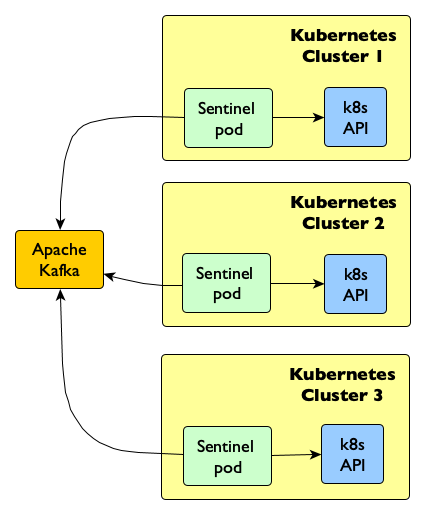

# Publishers 

Sentinel provides three publisher as follows:

## Logger 

The logger publisher publishes events to either the standard output or files in the file system.

Each event creates its own file following the naming convention below:

__TIMESTAMP_KIND_ACTION_KEY__.json

*For example*:

1559913224157037000_pod_CREATE_default_hello-node-546b66f89f-qhcnk.json

## Webhook

The webhook publisher performs an http post to one or more target endpoints and passes the event in json format via the payload.

## Broker

The broker publisher publishes the event messages into an Apache Kafka message broker.

The broker has a single topic called __k8s__ and the messages sent are to the broker keyed on __platform:namespace__ combination to ensure that messages from the same namespace are delivered to the message consumer in order.

An example of how to get started with Kafka can be seen [here](./getting_started.md).

### Multi Cluster publishing with Kafka

The following example shows a configuration where events are published from three Kubernetes clusters into Kafka:

[*] _The Sentinel icon was made by [Freepik](https://www.freepik.com) from [Flaticon](https://www.flaticon.com) and is licensed by [Creative Commons BY 3.0](http://creativecommons.org/licenses/by/3.0)_
