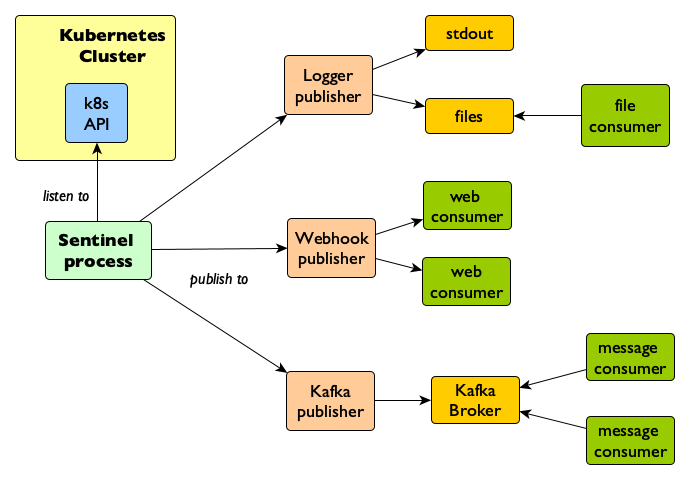

# Sentinel 

Sentinel is a Go application, which looks for state changes of [kubernetes objects](https://kubernetes.io/docs/concepts/overview/working-with-objects/kubernetes-objects/), and publish their associated metadata to specific endpoints for further processing by downstream systems.

The application process can either run inside or outside of a [Kubernetes](https://kubernetes.io/docs/concepts/) cluster and can publish events to either a [webhook](https://en.wikipedia.org/wiki/Webhook) or to an instance of the [Apache Kafka](https://kafka.apache.org/) message broker.

## Architecture

The following image shows how the application works:



## Topics

| Name | Description |
|---|---|
| [Getting Started](./docs/getting_started.md) | Various examples of how to get started using Sentinel. |
| [Configuration](./docs/configuration.md) | How to change Sentinel behaviour using configuration variables. |
| [Publishers](./docs/publishers.md) | A description of the various mechanisms to publish status changes to other systems. |
| [Scripts](./scripts/readme.md) | Various scripts to facilitate development and testing. |

## API compatibility

The current version uses the [Kubernetes API 1.11.10](https://github.com/kubernetes/api/releases/tag/kubernetes-1.11.10), compatible with Openshift 3.11.

To build the solution for another api version, the dependencies in the [go module](./go.mod) file has to be updated, for example, using [go get](https://golang.org/cmd/go/#hdr-Module_aware_go_get) as follows:

```bash
# for example, to update to version 1.14.2
$ go get -u k8s.io/api@kubernetes-1.14.2
$ go get -u k8s.io/apimachinery@kubernetes-1.14.2
$ go get -u k8s.io/client-go@kubernetes-1.14.2
```

__NOTE__: the minimal required [go version is 1.12.5](https://golang.org/dl/)

[*] _The Sentinel icon was made by [Freepik](https://www.freepik.com) from [Flaticon](https://www.flaticon.com) and is licensed by [Creative Commons BY 3.0](http://creativecommons.org/licenses/by/3.0)_
