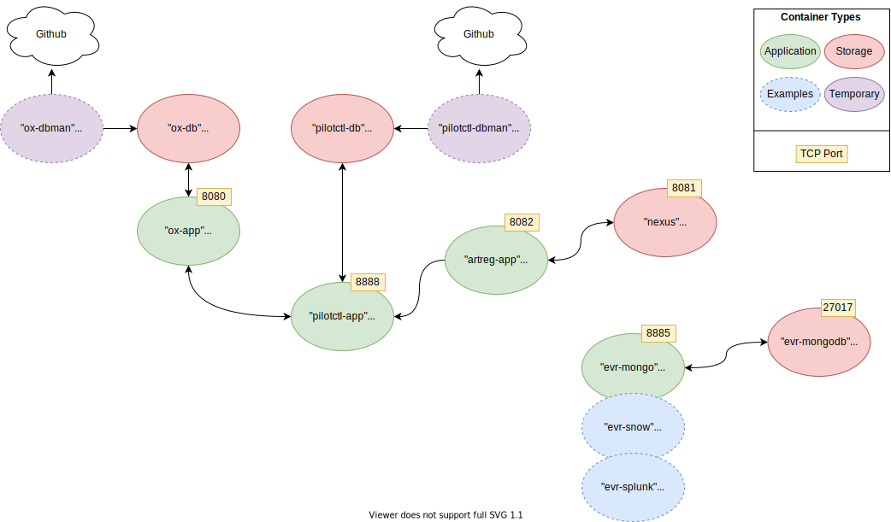

# Pilot Host Control Service

This section contains scripts to start up all required PilotCtl services:

- PostgreSQL and Mongo database servers
- Onix database
- PilotCtl database
- Onix Web API Service
- PilotCtl HTTP Service
- DbMan instances for database provisioning
- Event receiver service(s)




### Helper Scripts

Helper scripts are available - please use these rather than direct Docker commands as they may do other things outside of Docker to help configure your stack:

script | description
--- | ---
deploy.sh | deploys a completely new control plane from scratch
stop.sh | stops the stack but keeps the containers and persistent data
start.sh | re-starts an existing stack
destroy.sh | destroys the stack completely, including any persistent data

### Notes:
- Prior to starting the stack, it is expected that a Nexus server is available to the Docker network, and is configured with a "raw (hosted)" repository named "artisan". Credentials for this repo should be updated into the `.env` file

- An attachable Docker network should already be available (this is done for you by the startup script if it doesn't exist).

- By default, persistent databases are *not* exposed outside of the Docker network to your host. It is recommended that if you want to access them please see the optional `database.yaml` file (which provides a web based solution within the Docker network instead).

### Endpoints

Up-to-date endpoints on what has been deployed (along with credentials from the .env file) can be displayed by using the helper script `techinfo.sh`. Running this will give output similar to:

```
Technical Info

Onix Swagger
http://localhost:8080/swagger-ui.html
admin:ybGkxQ7GTVu3ek9eVQQM

Pilotctl Swagger
http://localhost:8888/api/index.html
admin@pilotctl.com:zcsvk9YhbQmzkcGp

Event Receiver (Mongo) Swagger
http://localhost:8885/api/index.html
admin:hrKXxojHE5rxjtH4

Artisan Registry Swagger
http://localhost:8082/api/index.html
admin:BMgEXPNVQ8fjxn6r

Artisan backend (Nexus)
http://localhost:8081/

Current Container tags
CIT_OX_APP -------- v0.0.4-1af14bb-021021131813
CIT_PILOTCTL_APP -- 0.0.4-061021135120757-114069b3db
CIT_ARTREG_APP ---- 0.0.4-011021162133879-a3dedecb3f-RC1
CIT_DBMAN --------- v0.0.4-d4fb6f7-031020001129
CIT_EVRMONGO_APP -- 0.0.4-300921174051295-11aab8b6cc
```

### Configuration Variables

Are held in the file [here](.env)
