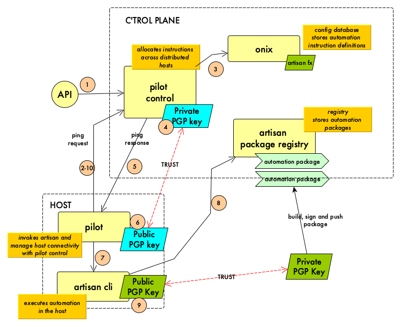

# Onix Host Pilot

Host Pilot safely executes automation on remote hosts, typically but not exclusively, in disconnected clouds.

Pilot does not impose requirements on the host such as being connected all the time or exposing an IP address for remote access.

## Architecture

The following diagram shows how pilot works:

1. Pilot C'trol is a service that allocates job requests to the varous pilot agents located on different managed hosts. A request for a new job is posted via its HTTP restful API.
2. Pilot agent issues an HTTPs ping request to pilot c'trol.
3. Pilot C'trol authenticates the request using a one-time time based token containing the host unique machine Id. Then checks that a job is waiting to be executed on the host. If found, it fetches the definition of the job function to execute from the Onix configuration database.
4. Pilot C'trol creates and signs a job request.

   

5. Pilot C'trol sends the job request using the pilot HTTPs ping response.
6. Pilot verifies the job request using Pilot C'trol public PGP key.
7. Pilot invokes artisan cli in the host to execute the job with the information provided in the job request.
8. Artisan pulls the required package from the registry and verifies it using the registry public PGP key deployed in the host.
9. Artisan executes the required package function and gather the execution output.
10. Pilot passes the execution output to Pilot C'trol, which in turn, stores the result and make it accessible via its restful API.

## Build it

To build the pilot host agent simply do:

```bash
art run build-linux
```

the binary can be found under the created bin folder.

## Run it

1. Launch the [Pilot Control Service](https://github.com/gatblau/onix/tree/develop/pilotctl/docker)
2. Set up the Pilot [configuration file](.pilot) in the folder where pilot is located
3. Ensure you have the Pilot Control Service's public PGP key either in the user home or in the pilot folder. The key file name should be [.pilot_verify.pgp](.pilot_verify.pgp).
4. Run the pilot

```bash
./bin/pilot
```

**NOTE**: to generate a PGP key pair you can use the following artisan command:

```bash
art pgp gen -n pilot-control -e mycompany@email.com -c "the key pair used by pilotctl service"
```

Then rename the keys to the required names as above.

## Running Pilot Host as a daemon

It may be that you wish to run Onix Host Pilot as a service - the following shows an example of how to do this utilising systemd on a Debian based OS where you have a copy of the Pilot binary in your working directory ready to use.

*NB. To perform the steps below, elevate privileges to root or run using SUDO*

### Create user

```
useradd -m piloth
```

### Copy pilot and set permissions

```bash
cp pilot /home/piloth/.
chown piloth:piloth /home/piloth/pilot
chmod 700 /home/piloth/pilot
```

### Create basic service

Create a new file `/lib/systemd/system/piloth.service` containing the following:

```bash
[Unit]
Description=Host Pilot service
ConditionPathExists=/home/piloth/pilot
After=network.target
 
[Service]
Type=simple
User=piloth
Group=piloth
LimitNOFILE=1024

Restart=on-failure
RestartSec=10
startLimitIntervalSec=60

WorkingDirectory=/home/piloth
ExecStart=/home/piloth/pilot

[Install]
WantedBy=multi-user.target
```
