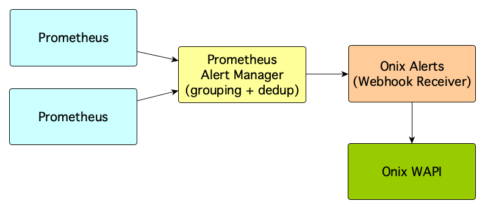
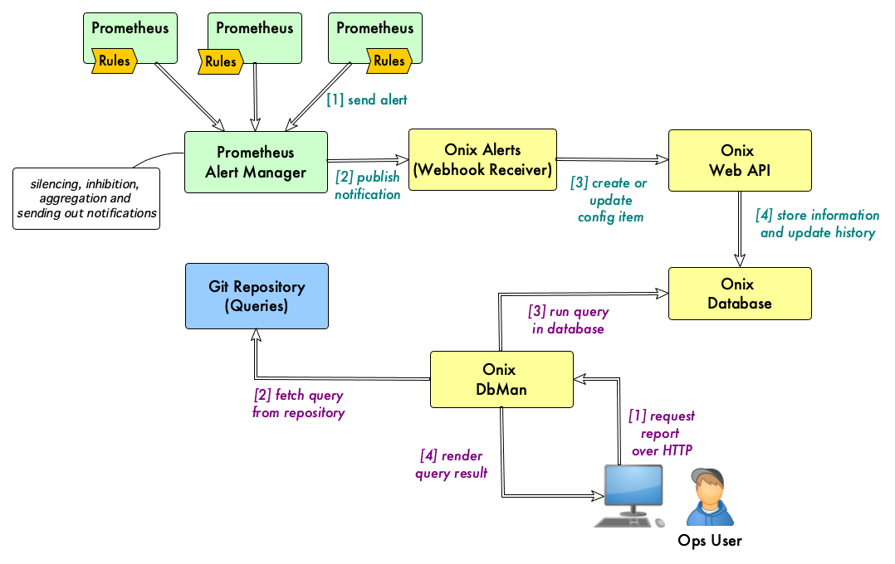

# Onix Alerts

Prometheus [Alert Manager](https://prometheus.io/docs/alerting/alertmanager/) handles alerts sent by one or more Prometheus servers.

After de-duplicating and grouping alerts, the alert manager routes them to a receiver.

*Onix Alerts* is a Prometheus Alert Manager [Webhook Receiver](https://prometheus.io/docs/alerting/latest/configuration/#webhook_config) that stores alert information as configuration items in the Onix database.

Onix creates a full auditable history of status changes which can be queried, for example, to obtain SLA information.

## Architecture

The following pictures shows how Onix Alerts integrates with the rest of the solution:

## Reporting based on Alert Information

The following figure shows how [DbMan](../../dbman/readme.md) can be used to report on alert information store in the Onix database:

