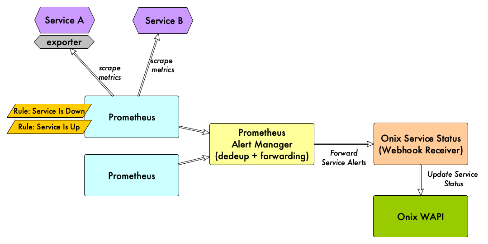
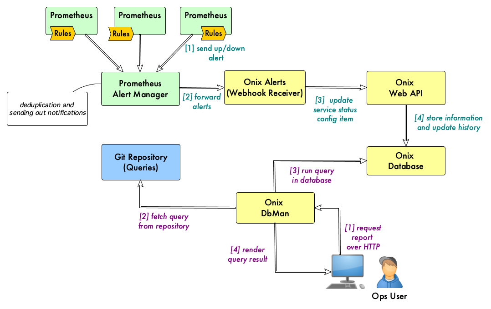

# Service Status (SeS)

### Prometheus Webhook Receiver for Onix

Service Status (SeS) is a [Webhook Receiver](https://prometheus.io/docs/alerting/latest/configuration/#webhook_config) for Pormetheus AlertManager, that records changes in service status in Onix, thus creating a queryable audit trail history.

Prometheus can detect when services are not available when it tries and scrape metrics and fail to do so.
In this case, the **up** syntethic function can be used within a Prometheus rule.

For example, take the case of an [etcd](https://github.com/etcd-io/etcd) server cluster. Etcd exposes Prometheus metrics via an http endpoint.

When Prometheus fails to scrape the endpoint, a "service is down" alert is sent to the alertmanager.
The alertmanager is responsible for deduplicating alerts and forwarding them to the SeS webhook receiver.

SeS in turn, stores the service status as a configuration item in Onix. Every time the status changes, the change is added to the item history.

## Architecture

The following pictures shows how Onix Alerts integrates with the rest of the solution:



## Reporting Service Status based on Alert Information

The following figure shows how [DbMan](../../dbman/readme.md) can be used to report on alert information store in the Onix database:



## SeS endpoint

Typically, SeS listen on an endpoint with the following syntax:

```sh
http(s)://ses-host:ses-port/{base-path}/{partition}
```

where:

a. **base-path**: is "alerts" by default by it can be changed by passing an environment variable.

b. **partition**: is the Onix database partition where the status information will be stored.

**NOTE**: the user SeS uses to connect to the Onix Web API must have write permission on the specified partition, otherwise SeS will not be able to store state change information.

## Configuration

| var  | description | default |
|---|---|---|
| **OXSES_LOGLEVEL** | set the log level. Possible values are Panic, Fatal, Error, Warn, Info, Debug, Trace | Trace |
| **OXSES_METRICS** | enable Prometheus metrics | true |
| **OXSES_AUTHMODE** | the authentication mode for the alerts endpoint. Possible values are none or basic. | none |
| **OXSES_PATH** | the base path for the alerts endpoint | alerts |
| **OXSES_PORT** | the port the SeS service listen on | 8888 |
| **OXSES_USERNAME** | the basic authentication username | admin |
| **OXSES_PASSWORD** | the basic authentication password | 0n1x |
| **OXSES_ONIX_URL** | the URL of the Onix Web API to which  SeS connects | http://localhost:8080 |
| **OXSES_ONIX_AUTHMODE** | the authentication mode used to connect to the Web API. Possible values are none, basic and oidc | basic |
| **OXSES_ONIX_CLIENTID** | client identifier for oidc authmode | |
| **OXSES_ONIX_APPSECRET** | application secret for oidc authmode  | |
| **OXSES_ONIX_TOKENURI** | the URI of the OIDC token service for oidc authmode | |
| **OXSES_ONIX_INSECURESKIPVERIFY** |  | true |

## Launching the container

```sh
> docker run -it --rm --name ses -p 8888:8888 gatblau/ses-snapshot:latest
```
