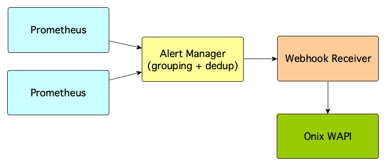

# Prometheus Alert Manager Webhook Receiver for Onix

Prometheus [Alert Manager](https://prometheus.io/docs/alerting/alertmanager/) handles alerts sent by a Prometheus server. 

After de-duplicating and grouping alerts, the alert manager routes them to a receiver.

The Webhook [receiver](https://prometheus.io/docs/alerting/configuration/#webhook_config) for Onix received alerts from the alert manager
and records status changes for specific resources.

Onix creates a full auditable history of status changes which can be queried, for example, to obtain SLA information.

Let's assume a specific endpoint is monitored by Prometheus. 
Then, say that you want to report on the overall downtime for the endpoint over a period.
A rule in the Alert Manager raises an alert everytime a resource becomes either available or unavailable.
The webhook receiver records the new status in Onix. 
As Onix keeps a full history of changes in the change tables, a report can be produced to determine what was the overall 
downtime over the requested period.

## Architecture

