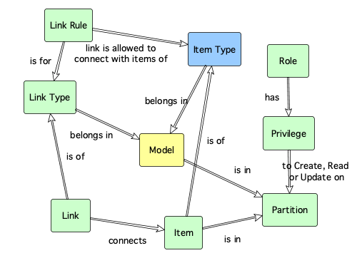

# ox_item_type Resource 

The ox_item_type resource, creates, updates or destroys an item type definition associated to a model.

An item type defines the characteristics of a configuration item, such as the attributes that can record, the structure of JSON metadata in the item, etc.

An item type has to be defined before an item can be created.

Item types can have zero or more [item type attributes](ox_item_type_attribute.md) that define the attributes that an item of this type can have.

## Example usage

In the example below, three item types are created to represent VPCs, Virtual Servers and a Storage Volumes:

```hcl
resource "ox_item_type" "AWS_VPC" {
  key         = "AWS_VPC"
  name        = "Virtual Private Cloud"
  description = "A logically isolated section of the AWS Cloud where AWS resources can be launched in a virtual network."
  model_key   = "AWS_EC2"
  managed     = false
}

resource "ox_item_type" "AWS_INSTANCE" {
  key         = "AWS_INSTANCE"
  name        = "AWS Instance"
  description = "A virtual server in the AWS Cloud."
  model_key   = "AWS_EC2"
  managed     = false
}

resource "ox_item_type" "AWS_EBS_VOLUME" {
  key         = "AWS_EBS_VOLUME"
  name        = "AWS Block Storage Volume"
  description = "A durable, block-level storage device that can be attached to one or more instances."
  model_key   = "AWS_EC2"
  managed     = false
}
```

## Argument reference

The following arguments can be passed to a configuration item:

| Name | Use | Type |  Description |
|---|---|---|---|
| `key` | *required* | string | *The natural key that uniquely identifies the item type.* |
| `name`| *required* | string | *The display name for the item type.* |
| `description`| *required* | string | *A meaningful description for the item type.* |
| `model_key` | *required* | string | *The natural key uniquely identifying the model this item type is part of.* |
| `filter`| optional | JSON | *Defines one or more filters, namely [JSON Path](https://goessner.net/articles/JsonPath/) expressions that allow the Web API to extract parts of the JSON metadata stored in a configuration item. The format of the filter is described in the notes section below.* |
| `meta_schema` | optional | JSON | *The [JSON Schema](https://json-schema.org/) used to validate the JSON metadata stored in a configuration item's meta attribute.* |
| `notify_change` | optional | boolean | *Determines whether notification events should be sent by the Web API when items of this type are created, updated or deleted. The default value is false.* |
| `tag` | optional | string array | *A list of tags used for searching and clasifying the item type.* |
| `encrypt_meta` | optional | boolean | *A flag indicating whether the meta attribute of the configuration item of this type should have encryption of data at rest.* |
| `encrypt_txt` | optional | boolean | *A flag indicating whether the txt attribute of the configuration item of this type should have encryption of data at rest.* |
| `managed` | optional | boolean | *A flag indicating whether the item type is managed by a third party process. The default value is false, indicating the type can be updated by the user interface or Terraform provider clients.* |
| `version` | optional | integer | *The version number of the item type for [optimistic concurrency control](https://en.wikipedia.org/wiki/Optimistic_concurrency_control) purposes. If specified, the entity can be written provided that the specified version number matches the one in the database. If no specified, optimistic locking is disabled.* |

## Key dependencies

An item type belongs in a model and therefore, a model should exist first and be specified by the *model_key* attribute.



## Related entities

- Item Type **belongs in** [Model](ox_model.md)
- [Link Rule](ox_link_rule.md) **link is allowed to connect with items of** Item Type
- [Item](ox_item.md) **is of** Item Type
- Item Type **has** [Item Type Attribute](ox_item_type_attribute.md)(s)

## Notes

### Filter format

To ilustrate the use of filters, the following example shows how three filters are associated with the JSON metadata of an item of a specific type. 

The filter attribute of the item type is:

```hcl
filter = {
    "filters": [
      {
        "authors": [
          {"authors_of_all_books": "$.store.book[*].author"},
          {"all_authors": "$..author"}
        ]
      },
      {
        "store": [
          {"all_books_and_bikes": "$.store.*"},
          {"all_prices": "$.store..price"}
        ]
      },
      {
        "books": [
          {"not_expensive": "$..book[?(@.price <= $['expensive'])]"},
          {"last_two": "$..book[-2:]"},
          {"cheaper_than_ten": "$.store.book[?(@.price < 10)]"},
          {"book_count": "$..book.length()"}
        ]
      }
    ]
  }
```

Each filter can have one or more [json paths](https://goessner.net/articles/JsonPath/) defined. Where more than one path is defined per filter, the Web API runs an extraction for each path and builds a map result object.

For example, when querying the endpoint **/item/item_01/meta/books** the API will search on the JSON metadata of the configuration item ***item_01*** for paths matching:

- "*not_expensive*" and
- "*last_two*" and
- "*cheaper_than_ten*" and
- "*book_count*"

Additionally, the following queries are also available on ***item_01***:

- **/item/item_01/meta/authors**
- **/item/item_01/meta/store**
  
### Meta Schema Format

[JSON Schema](https://json-schema.org/draft/2019-09/json-schema-validation.html) is a specification for defining the structure of JSON data.

The following example shows how to set the meta_schema attribute of an item type:

```hcl
meta_schema = {
    "$schema": "http://json-schema.org/draft-07/schema#",
    "$id": "http://example.com/product.schema.json",
    "title": "Product",
    "description": "A product from Acme's catalog",
    "type": "object",
    "properties": {
      "productId": {
        "description": "The unique identifier for a product",
        "type": "integer"
      },
      "productName": {
        "description": "Name of the product",
        "type": "string"
      },
      "price": {
        "description": "The price of the product",
        "type": "number",
        "exclusiveMinimum": 0
      }
    },
    "required": [ "productId", "productName", "price" ]
  }
  ```