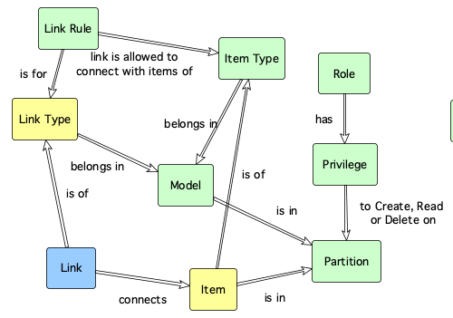

# ox_link Resource 

Creates, updates or destroys a link between two configuration items.

A link, connects two existing configuration items. A link has a direction (i.e. from item and to item) and can carry information in a similar way as an item (i.e. meta, txt, tag, attribute)

## Example Usage

```hcl
resource "ox_link" "Link_1" {
  key            = "vpc01_vm01_link"
  description    = "VM01 is in VPC01"
  type           = "AWS_EC2_LINK"
  start_item_key = "VPC01"
  end_item_key   = "VM01"
  meta = {
     ... a json object goes here ...
  }
  txt = "Free format text here."
  attribute = {
    "TEAM" : "Blue",
    "CATEGORY" : "Social"
  }
  tag = [ "tag1", "tag2", "tag3"]
}
```

## Argument Reference

The following arguments can be passed to a configuration item:

| Name | Use | Type |  Description |
|---|---|---|---|
| `key` | required | string | *The natural key that uniquely identifies the link.* |
| `description`| required | string | *A meaningful description for the link.* |
| `type` | required | string | *The natural key that uniquely identifies the [type of link](ox_link_type.md).* |
| `meta` | optional | json | *Stores any information in JSON format. It can be automatically encrypted if required.* |
| `txt` | optional | text | *Stores any information in text format. It can be automatically encrypted if required.* |
| `attribute` | optional | map of strings | *Stores zero or more key-value pairs that are defined in the item type.* |
| `tag` | optional | array of string | *Stores zero or more tags that can be used to classify or search for the item.* |
| `version` | optional | integer | *The version number of the item. If specified, optimistic locking is enabled: if the specified version is different than the stored version, no changes are made and a locking situation is assumed.* |

## Key dependencies

Before creating a link, a link type must exists. Additionally, two items must also exists so that they can be connected by the link.



## Related resources

- Link **connects** [Item](ox_item.md)(s)
- Link **is of type** [Link Type](ox_link_type.md)

## Web API endpoints

This resource uses the following Web API endpoint: 

```bash
/link/{link_key}
```

The table below shows what methods are mapped to what operations in the terraform resource:

| **Method** | **Operation** |
|:---:|:---:|
| PUT | Create |
| GET | Read |
| PUT | Update |
| DELETE | Delete  |