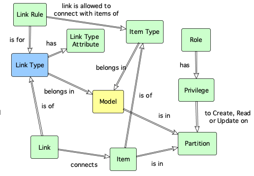

# ox_link_type Resource 

The ox_link_type resource, creates, updates or destroys a link type definition associated to a model.

A link type defines the characteristics of an item link, such as the attributes that can record, the structure of JSON metadata in the link, etc.

A link type has to be defined before a link can be created.

Link types can have zero or more [link type attributes](ox_link_type_attr.md) that define the attributes that a link of this type can have.

## Example usage

In the example below, a link type is created to link VPCs, Virtual Servers and a Storage Volumes:

```hcl
resource "ox_link_type" "AWS_EC2_LINK" {
  key         = "AWS_EC2_LINK"
  name        = "AWS EC2 Resources Link"
  description = "A link between AWS EC2 resources."
  model_key   = "AWS_EC2"
  managed     = false
}
```

## Argument reference

The following arguments can be passed to a link type:

| Name | Use | Type |  Description |
|---|---|---|---|
| `key` | *required* | string | *The natural key that uniquely identifies the link type.* |
| `name`| *required* | string | *The display name for the link type.* |
| `description`| *required* | string | *A meaningful description for the link type.* |
| `model_key` | *required* | string | *The natural key uniquely identifying the model this link type is part of.* | `meta_schema` | optional | JSON | *The [JSON Schema](https://json-schema.org/) used to validate the JSON metadata stored in a link's meta attribute.* |
| `tag` | optional | string array | *A list of tags used for searching and clasifying the link type.* |
| `encrypt_meta` | optional | boolean | *A flag indicating wether the meta attribute of a link of this type should have encryption of data at rest.* |
| `encrypt_txt` | optional | boolean | *A flag indicating wether the txt attribute of a link of this type should have encryption of data at rest.* |
| `managed` | optional | boolean | *A flag indicating whether the link type is managed by a third party process. The default value is false, indicating the type can be updated by the user interface or Terraform provider clients.* |
| `version` | optional | integer | *The version number of the link type for [optimistic concurrency control](https://en.wikipedia.org/wiki/Optimistic_concurrency_control) purposes. If specified, the entity can be written provided that the specified version number matches the one in the database. If no specified, optimistic locking is disabled.* |

## Key dependencies

A link type belongs in a model and therefore, a model should exist first and be specified by the *model_key* attribute.



## Related entities

- Link Type **belongs in** [Model](ox_model.md)
- [Link Rule](ox_link_rule.md) **is for** Link Type
- [Link](ox_link.md) **is of** Link Type
- Link Type **has** [Link Type Attribute](ox_link_type_attr.md)(s)

## Web API endpoints

This resource uses the following Web API endpoint: 

```bash
/linktype/{link_type_key}
```

The table below shows what methods are mapped to what operations in the terraform resource:

| **Method** | **Operation** |
|:---:|:---:|
| PUT | Create |
| GET | Read |
| PUT | Update |
| DELETE | Delete  |

## Notes

### Filters

In contrast to [item types](ox_item_type.md), link types do not currently support filters for *meta* fields in links. This feature might be considered for future releases.
  
### Meta Schema Format

[JSON Schema](https://json-schema.org/draft/2019-09/json-schema-validation.html) is a specification for defining the structure of JSON data.

The following example shows how to set the meta_schema attribute of an item type:

```hcl
meta_schema = {
    "$schema": "http://json-schema.org/draft-07/schema#",
    "$id": "http://example.com/product.schema.json",
    "title": "Product",
    "description": "A product from Acme's catalog",
    "type": "object",
    "properties": {
      "productId": {
        "description": "The unique identifier for a product",
        "type": "integer"
      },
      "productName": {
        "description": "Name of the product",
        "type": "string"
      },
      "price": {
        "description": "The price of the product",
        "type": "number",
        "exclusiveMinimum": 0
      }
    },
    "required": [ "productId", "productName", "price" ]
  }
  ```