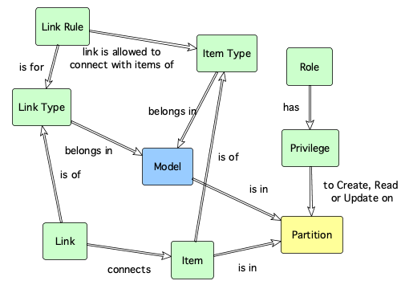

# ox_model Resource 

The ox_model resource, creates, updates or destroys a data model definition.

A data model defines a set of item types, link types and link rules that are required to store a particular configuration set.

The information in a model provides the structure to validate stored information for a particular use case.

For example, when assessing a configuration data storage requirement, a model is created to define what types of items and links are needed and how items should be linked between each other.

A data model has to be defined before items types,  link types, and configuration items can be created and linked.

## Example usage

```hcl
resource "ox_model" "AWS_EC2" {
  key         = "EC2"
  name        = "Elastic Compute Cloud Resources"
  description = "Describe the relations between Virtual Machines in AWS EC2"
  managed     = false
}
```

## Argument reference

The following arguments can be passed to a configuration item:

| Name | Use | Type |  Description |
|---|---|---|---|
| `key` | *required* | string | *The natural key that uniquely identifies the model.* |
| `name`| *required* | string | *The display name for the model.* |
| `description`| *required* | string | *A meaningful description for the model.* |
| `partition`| optional | string | *The logical access partition the model is in. If not specified, the default reference partition (REF) is used.* |
| `managed` | optional | boolean | *A flag that informs whether the model is managed by an external application process. The default value is FALSE.* |
| `version` | optional | integer | *The version number of the model for [optimistic concurrency control](https://en.wikipedia.org/wiki/Optimistic_concurrency_control) purposes. If specified, the entity can be written provided that the specified version number matches the one in the database. If no specified, optimistic locking is disabled.* |

## Key dependencies

Before creating a model, a logical partition has to exist. Logical partitions are used to control access to the data based on roles. Where no partition is selected when creating a model, the model is automatically placed in the default reference partition - REF.



## Related resources

- ox_model **is in** [ox_partition](ox_partition.md)
- [ox_item_type](ox_item_type.md) **belongs in** ox_model
- [ox_link_type](ox_link_type.md) **belongs in** ox_model
