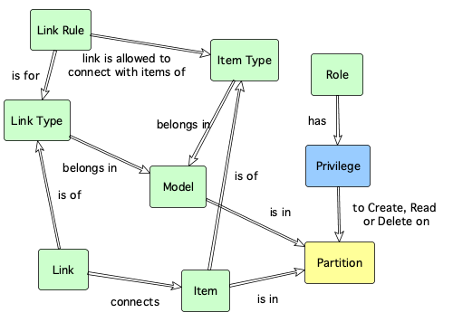

# ox_privilege Resource 

The ox_privilege resource, creates, updates or destroys data access privileges.

A privilege is an entitlement for a user in a specific [role](ox_role.md) to Create (or Update - Upsert), Read or Delete entities that exist within a logical [partition](ox_partition.md). As such, a privilege requires a [role](ox_role.md) and a [partition](ox_partition.md) to be defined first.

When a user logs in, a session is created with the list of roles the user is part of. These roles are passed to the database to make access decisions.

Roles are taken from the [GrantedAuthority](https://docs.spring.io/spring-security/site/docs/4.2.4.RELEASE/apidocs/org/springframework/security/core/GrantedAuthority.html) object in the Web API user session.

The role attachement behaviour depends on the Web API authentication mode selected:

| Auth Mode | Behaviour |
|---|---|
| `none` | The ADMIN role is attached to any request. Full access is provided to any resource. |
| `basic` | The role attached to the user depends on the basic authentication login credentials passed to the service. They can be one of ADMIN, READER, or WRITER.
| `oidc` | The role(s) attached are the ones in the OpenId Connect token for the user. |

## Reading data

For example, if the user is trying to retrieve data, the system checks that any of the roles the user is in, has *Read* privilege for entities in the [partition](ox_partition.md) where the data is. If not, then no data is retrieved but no error is issued.

## Changing data

In cases where the user wants to Create, Update or Delete data, the database check whether the user has the correct privilege attached to any of  their roles. If not, a privilege missing error is issued to the client.

## Example usage

The following example shows how to create a privilege that grants read only access to entities in the partition for the Logistics Department. It also attaches the privilege to the Logistics Department Reader role.

```hcl
resource "ox_privilege" "Logistics_Department_Reader_Privilege" {
  key         = "PRIVILEGE_LOGISTICS_DEPT_READER"
  name        = "Logistics Department Reader Privilege"
  description = "Allows the holder to read data in the logistic department partition."
  partition = "PARTITION_LOGISTICS_DEPT"
  role = "ROLE_LOGISTICS_ADMIN"
  can_create = false
  can_read = true
  can_delete = false
}
```

## Argument reference

The following arguments can be passed to a logical partition:

| Name | Use | Type |  Description |
|---|---|---|---|
| `key` | *required* | string | *The natural key that uniquely identifies the logical partition.* |
| `name`| *required* | string | *The display name for the logical partition.* |
| `description`| *required* | string | *A meaningful description for the logical partition.* |
| `version` | optional | integer | *The version number of the partition for [optimistic concurrency control](https://en.wikipedia.org/wiki/Optimistic_concurrency_control) purposes. If specified, the entity can be written provided that the specified version number matches the one in the database. If no specified, optimistic locking is disabled.* |

## Key dependencies

A privilege requires a [role](ox_role.md) and a [partition](ox_partition.md) to be defined first.



## Related resources

- Privilege **allows to create, read or delete data in** [Partition](ox_partition.md)
- [Role](ox_role.md) **has** Privilege

## Web API endpoints

This resource uses the following Web API endpoint: 

```bash
/privilege/{privilege_key}
```

The table below shows what methods are mapped to what operations in the terraform resource:

| **Method** | **Operation** |
|:---:|:---:|
| PUT | Create |
| GET | Read |
| PUT | Update |
| DELETE | Delete  |